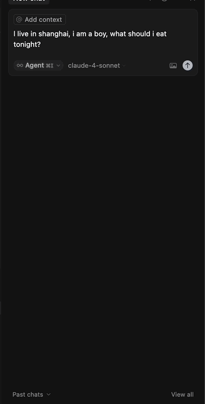

<p align="center">
  
</p>

[中文版说明 (Chinese Version)](./docs/README-cn.md) [What is Liuyao/什么是六爻](./docs/Introduction-to-Liuyao.md) 

# Hexapulse

## Project Introduction
**Hexapulse** is an intelligent divination **MCP** tool designed for all users. It allows you to obtain rigorous and professional hexagram interpretations with only the most basic information, without needing to understand the complex principles of the I Ching. Whether you want to explore life directions, solve real-world problems, or simply experience the wisdom of traditional culture, mcp will treat every one of your questions with care.

## How to Use
1. **Configure the following in any mcp client (cursor, cline, Claude):**

   **macOS:**
   ```json
   {
       "mcpServers":{
           "liuyao":{
               "command": "npx",
               "args": ["-y", "mcp-server-liuyao"]
           }
       }
   }
   ```

   **Windows:**
   ```json
   {
       "mcpServers":{
           "liuyao":{
               "command": "cmd",
               "args": ["/c","npx","-y","mcp-server-liuyao","--studio"]
           }
       }
   }
   ```

2. **Ask agent what to eat tonight.**

   <p align="center">
     
   </p>

3. **Feel the guide of God**

## The mcp tool will automatically:
1. Toss 3 coins at a time, generating one line of the hexagram, for a total of 6 times (Six Yao method)
2. Calculate the true solar time for your location (this is crucial for accurate results!)
3. Automatically interpret the hexagram and provide a detailed response

## Features
- **Simple**: Only information related to your question is needed, no need to understand the underlying principles.
- **Rigorous**: Each divination combines randomness and true solar time to ensure results are serious and in line with the I Ching.
- **Inclusive**: No matter what type of question you ask, mcp will treat it seriously and provide a response.

## Next Steps
- **Image Output**: Directly output the generated hexagram as an image
- **Agent Support**: Agent as a tool
If you need further help or have any questions, feel free to leave a message in the Issues section. mcp is committed to providing every user with a professional and friendly divination experience!
